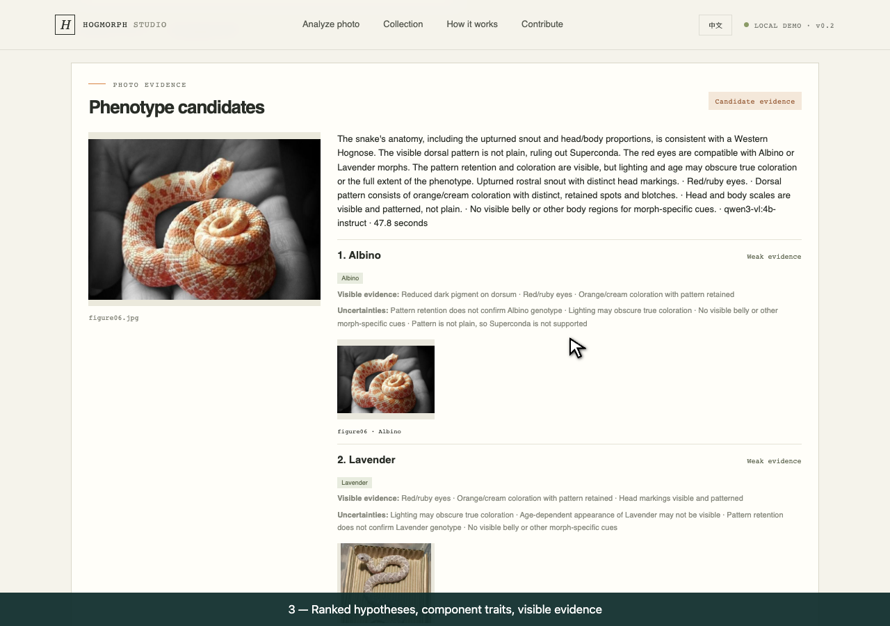

<div align="center">
  
  <h1>HogMorph Studio</h1>
  <p><strong>See the pattern. Respect the unknown.</strong></p>
  <p>A bilingual Western Hognose phenotype assistant: upload a photo, compare visible evidence with real reference photographs, and explore the genes behind morph names.</p>
  <p><a href="README.zh-CN.md">简体中文</a> · <strong>English</strong></p>
  <p><code>TypeScript</code> · <code>FastAPI</code> · <code>Qwen3-VL</code> · <code>Ollama</code></p>
</div>

## Photo → observation → reference comparison

The demo uses a **pretrained vision-language model**, with Ollama's `qwen3-vl:4b-instruct` as the default. It observes the uploaded photo, proposes phenotype candidates, then compares the photo against up to three relevant real reference images from the 886-photo archive. The server validates trait IDs and states and derives combination names from the project's ontology.

Results show up to three candidate morphs, component traits, visible observations, evidence strength, limitations, real reference photographs, the model used, and measured request duration. Evidence strength is qualitative; it is not calibrated probability, softmax confidence, or proof of a genotype. A photo cannot establish hidden carrier status.

English is the default; the entire workbench also supports Chinese. Dataset curation, species references, morph terminology, and the original research modules remain available.

> **Experimental demo:** initial local runs with the 18-photo library returned the expected Albino component set, but missed Snow/Sunburst components and did not resolve Superconda. New data does not itself establish recognition accuracy. Review [measured runs and limitations](docs/demo-acceptance.md) before using model suggestions.

## Run the demo

Requirements: Python 3.10+, Node.js/npm, and [Ollama](https://ollama.com/). Allow disk and memory for the vision model; inference time depends on hardware.

```bash
git clone https://github.com/Yaomeng1749/HogMorphStudio.git
cd HogMorphStudio
python3 -m venv .venv-demo
source .venv-demo/bin/activate
python -m pip install -r requirements-demo.txt
npm ci
ollama pull qwen3-vl:4b-instruct
npm run demo
```

Open <http://127.0.0.1:8000/>. The unified server serves the interface, API, and packaged reference images. Start Ollama before analyzing a photo. A model that is missing, unreachable, or not configured produces an explicit status rather than a substitute color score.

See [demo configuration and behavior](docs/multimodal-demo.md) for provider configuration, API boundaries, and failure handling. PyTorch is **not required for the demo**; `requirements-ml.txt` is a separate research environment.

## Real references, limited claims

**886 real reference photographs** are packaged: 868 owner-labelled images across 12 morph combinations from `Genes.zip`, plus 18 course references. The folder labels are decomposed into atomic traits and supported states. The original ZIP remains local; packaged images are oriented, resized and stripped of embedded metadata.

Lucy, Chocolate and Skull Face remain outside the supported course set. Unrecorded traits remain unknown; Extreme Red and White Wall are not output as base loci. [Dataset counts and folder mapping](docs/genes-dataset.md) · [Import summary](data/genes_import_summary.json).

The supported base traits are Anaconda, Arctic, Albino, Axanthic, Sable, Toffee Belly, and Lavender. Superconda and Super Arctic retain their homozygous distinctions. Combination names include Snow (Albino + Axanthic) and Sunburst (Albino + Sable).

These images supply comparison context. They are not an independent test set, and the project has not trained or validated a supervised morph classifier. Demo consistency checks on these reference photos cannot establish recognition accuracy. See [reference manifest](data/demo_references.json) and [asset rights](ASSET_RIGHTS.md).

The owner requested removal of the 207 incoming visual candidates. They are no longer part of the demo or a training corpus; 16 uncertain images remain quarantined privately. Missing individual identities and independent evaluation still limit the supervised research path.

## Interface



[Measured inference runs](docs/demo-acceptance.md) · [Labelled dataset](docs/genes-dataset.md)

## Research work retained

The original CNN, FPPA denoising, Butterworth filtering, and MobileNetV3-Small multilabel training pipeline are retained as research modules. The historical synthetic-noise experiment measures reconstruction quality; the random-weight speed benchmark compares architectures. Neither measures the new multimodal assistant's accuracy or latency.

```bash
python3 -m venv .venv-ml
source .venv-ml/bin/activate
python -m pip install -r requirements-ml.txt
python scripts/python_reproduction.py --help
```

The supervised trainer uses masked labels, individual-grouped splits, and data eligibility gates. See [model architecture](docs/model-architecture.md), [experiment plan](docs/experiment-plan.md), and [Python reproduction](docs/python-model-port.md).

## Project map

- `src/` — bilingual analysis interface, terminology, curation, and species-reference modules
- `data/demo_references.json` — authorized demo photo provenance and partial, reviewed trait annotations
- `data/ontology.json` — base traits, supported states, morph aliases, and uncertainty rules
- `scripts/` — original Python model reproduction and dataset/evaluation tools
- `docs/` — demo configuration, architecture, dataset provenance, and research evidence

## License

Project-authored software: [MIT](LICENSE-CODE). Photo rights are separate: packaged course references are authorized for this project demo, not relicensed under MIT. Species-only photos preserve their individual CC0/CC BY terms and attribution. Consult [ASSET_RIGHTS.md](ASSET_RIGHTS.md) before redistributing photographs or source materials.
