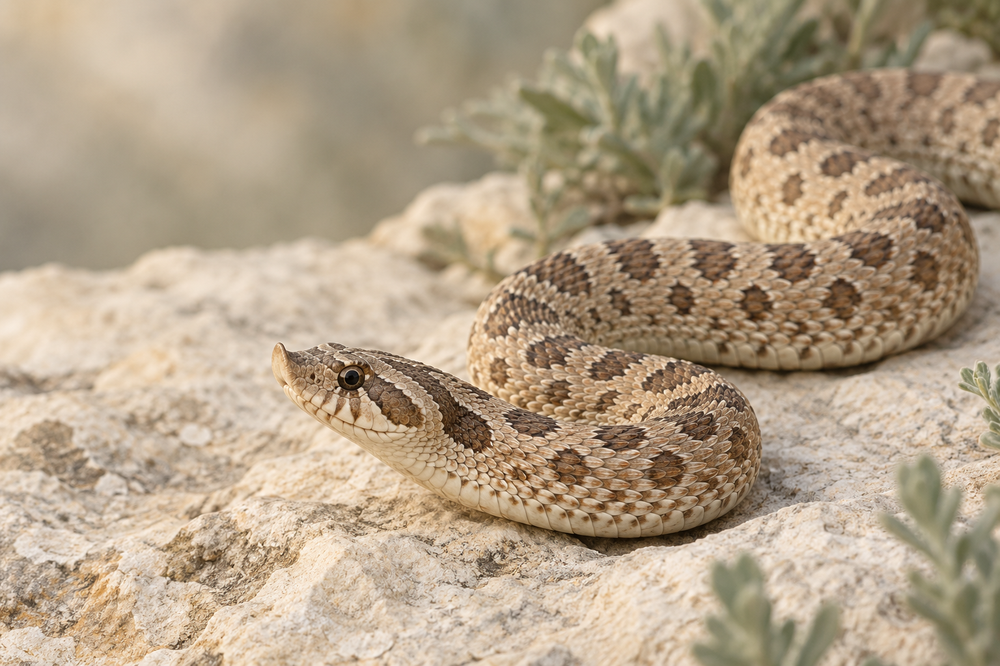

<div align="center">
  
  <h1>HogMorph Studio</h1>
  <p><strong>观察表型，尊重未知。</strong></p>
  <p>双语西部猪鼻蛇表型辅助判断工具：上传照片、对照真实参考图，并了解组合名称背后的基础性状。</p>
  <p><strong>简体中文</strong> · <a href="README.md">English</a></p>
  <p><code>TypeScript</code> · <code>FastAPI</code> · <code>Qwen3-VL</code> · <code>Ollama</code></p>
</div>

## 照片 → 观察 → 实拍对照

Demo 默认使用 Ollama 的 `qwen3-vl:4b-instruct` **预训练多模态模型**。先观察上传照片并提出表型候选，再将照片与最多三张相关真实参考图比较。服务端校验基础性状 ID 与状态，通过项目本体生成组合名。

结果显示最多三个候选、基础性状拆解、可见依据、证据强弱、限制、实拍参考图、所用模型与请求耗时。证据强弱是定性判断，不是校准概率、softmax 置信度或基因型证明；照片无法证明隐性携带状态。

默认英语，支持中文。数据整理、物种参考、形态术语与原有研究模块均保留。

## 本地运行

需要 Python 3.10+、Node.js/npm 和 [Ollama](https://ollama.com/)。视觉模型需要相应磁盘和内存，推理耗时取决于硬件。

```bash
python3 -m venv .venv-demo
source .venv-demo/bin/activate
python -m pip install -r requirements-demo.txt
npm ci
ollama pull qwen3-vl:4b-instruct
npm run demo
```

打开 <http://127.0.0.1:8000/>。统一服务提供网页、API 和随仓库分发的参考图。分析前启动 Ollama；模型缺失、不可连接或未配置时会显示具体状态，不会用旧颜色评分代替。

配置与接口说明见[多模态 demo 指南](docs/multimodal-demo.md)。运行 demo **不需要 PyTorch**；`requirements-ml.txt` 属于独立研究环境。

## 真实参考图与能力边界

项目所有者已确认朋友提供的 21 张课程照片的历史标签，并授权用于本 demo。其中 **18 张随仓库作为表型参考图分发**；Lucy、Chocolate、Skull Face 不进入支持的参考集。标签仍是部分标注，未记录的性状保留为未知。未定义的历史标签、Extreme Red 与白墙不进入基础基因候选。

支持的基础性状为 Anaconda、Arctic、Albino、Axanthic、Sable、Toffee Belly、Lavender。Superconda、Super Arctic 保留纯合状态区别；Snow 拆解为 Albino + Axanthic，Sunburst 为 Albino + Sable。

这些照片提供对照上下文，属于参考集，不是独立测试集。本项目没有训练并验证过的监督形态分类器；对参考图做演示一致性检查不能得出识别准确率。详见[参考图清单](data/demo_references.json)与[照片权利说明](ASSET_RIGHTS.md)。

项目所有者已要求删除 207 张视觉候选图，它们不再进入 demo 或训练语料；16 张不确定照片仍在本机隔离。监督研究仍受单蛇身份和独立评估数据不足的限制。

## 演示录屏

此前的[界面导览视频](docs/assets/hogmorph-studio-demo.mp4)展示旧版本的双语整理界面，**没有展示当前多模态推理链路**。旧视频中的待整理照片是 AI 插画，不是生物证据；上方主视觉同样是插画。新版真实推理录屏与实测结果完成后，与 demo 验收记录一起提供。

## 保留的研究线路

旧 CNN、FPPA 降噪、Butterworth 滤波、MobileNetV3-Small 多标签训练流程继续保留。历史合成噪声实验只衡量图像重建质量；随机权重速度实验只比较架构，均不能说明新多模态辅助判断的准确率或耗时。

```bash
python3 -m venv .venv-ml
source .venv-ml/bin/activate
python -m pip install -r requirements-ml.txt
python scripts/python_reproduction.py --help
```

监督训练器保留掩码标签、按蛇只切分和训练数据门槛。详见[模型架构](docs/model-architecture.md)、[实验计划](docs/experiment-plan.md)和[Python 复现](docs/python-model-port.md)。

## 项目结构

- `src/` — 双语分析界面、术语、数据整理与物种参考模块
- `data/demo_references.json` — 授权 demo 图片来源及复核后的部分性状标注
- `data/ontology.json` — 基础性状、状态、组合别名与不确定性规则
- `scripts/` — 原有 Python 模型复现与数据集评估工具
- `docs/` — demo 配置、架构、来源与研究证据

## 许可

项目自有代码使用 [MIT](LICENSE-CODE)。图片许可单独处理：课程参考图已获本项目 demo 使用授权，不随代码重新采用 MIT。物种参考照片保留各自 CC0/CC BY 条款与署名。复用前查看 [ASSET_RIGHTS.md](ASSET_RIGHTS.md)。
