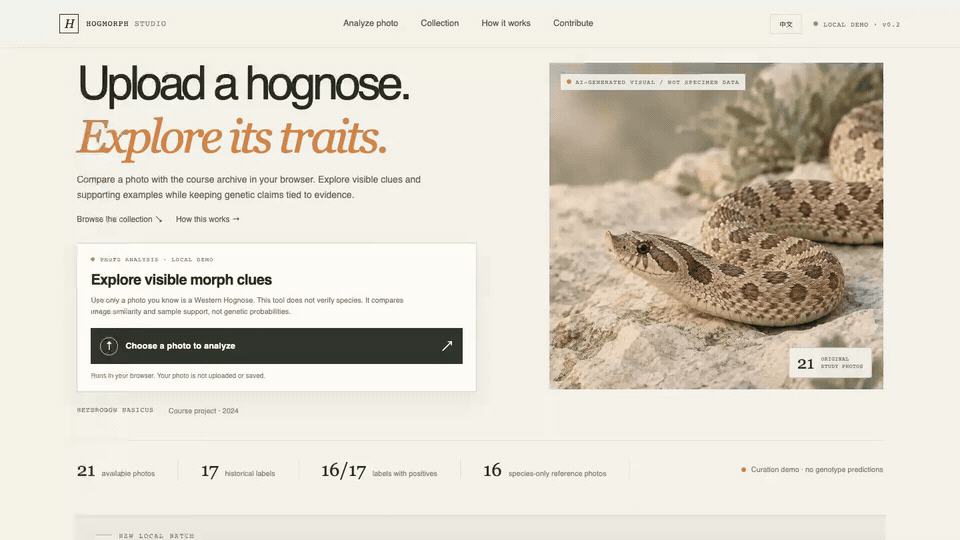

<div align="center">
  
  <h1>HogMorph Studio</h1>
  <p><strong>观察表型，尊重未知。</strong></p>
  <p>面向西部猪鼻蛇照片复核、形态术语整理与数据集建设的双语本地优先工作台。</p>
  <p><strong>简体中文</strong> · <a href="README.md">English</a></p>
  <p><code>TypeScript</code> · <code>Python</code> · <code>PyTorch</code> · <code>本地优先</code></p>
</div>

## 项目演示

<p align="center">
  <a href="docs/assets/hogmorph-studio-demo.mp4">
    
  </a>
  <br><sub>点击预览可打开 27 秒 MP4。录屏中的待整理图片是 AI 生成的界面插画，不是生物样本。</sub>
</p>

录屏展示双语界面、已实现的研究流程、实测运行速度对比和本地复核表单。它**没有展示训练好的形态分类器**。当前照片分析仍是颜色与布局相似度基线；百分比不是 softmax 置信度、基因概率，也不能证明某种形态。

## 已实现功能

- **本地照片复核。** 浏览器在内存中处理所选图片。干净克隆版没有随附经授权的形态参考集，因此不会给出相似度分数。
- **先收集证据，再标注。** 复核草稿可记录来源链接、单蛇 ID、图片使用权、遗传证据、标注人、复核人和不确定性，并导出 JSON。
- **拆分商品名与基础性状。** 形态商品名可映射为最小单位性状，例如本体将 Sunburst 表示为 Albino + Sable。“白墙”单独记录为外观描述，不是基因。
- **复现并测量研究线路。** Python/PyTorch 实现包含历史 CNN、FPPA 降噪、Butterworth 滤波，以及带蛇只分组评估的 MobileNetV3-Small 多标签训练流程。
- **显式保留不确定性。** 未知标签仍是未知；野外外观不能作为已证实的遗传阴性。

## 当前证据与能力边界

这是可运行的研究原型，不是经过验证的遗传检测工具。MobileNet 训练器已实现，但**尚未训练**：目前符合形态标签核实、单蛇身份、训练/评估授权与独立评估等全部条件的记录为 **0**。项目没有可宣称的形态分类准确率。

浏览器基线在开发者本机拥有原始课程图片档案时，会将颜色直方图和粗略空间颜色网格与 **21 张课程照片**比较。它衡量的只是最近图片的颜色/布局重叠和样本支持度。背景、裁剪、光线均可能影响结果，因此不能用于判断基因型或隐性携带状态。课程照片档案不随仓库分发。干净克隆版仍可用于整理数据；在提供有授权的复核参考集前，分析界面会拒绝给出相似度分数。

### 已完成的模型工作

| 工作 | 结果 | 能说明什么 |
| --- | --- | --- |
| 21 张课程图，在固定合成噪声协议下测试 FPPA 降噪 | 平均 PSNR 22.3315 → 26.7765 dB；SSIM 0.5076 → 0.7598 | 只证明图像重建指标变化，不代表形态识别改善 |
| Apple M5 上比较旧 CNN 与 MobileNetV3-Small，batch=1、随机权重 | CNN：CPU 中位数 6.027 ms / MPS 1.317 ms；MobileNet：CPU 16.795 ms / MPS 6.705 ms | 只比较架构与运行速度；本机上 MobileNet 参数更少但速度更慢 |
| MobileNetV3-Small 多标签训练流程 | 已实现 masked BCE-with-logits、按蛇只切分、逐类样本门槛和按个体 bootstrap 区间 | 数据门槛满足前不训练，也不宣称准确率 |

完整协议、p95 时间、硬件与软件环境、样本门槛及限制见[模型架构](docs/model-architecture.md)、[实验计划](docs/experiment-plan.md)与[Python 复现记录](docs/python-model-port.md)。

## 本地运行

需要 Node.js/npm、Python 3 和浏览器。不需要 API key 或在线推理服务。

```bash
npm ci
npm run build
python3 -m http.server 8000 --bind 127.0.0.1
```

打开 <http://127.0.0.1:8000/>，可在英文和中文之间切换。干净克隆版在安装经核验且已获授权的形态参考集前会拒绝打分。整理草稿只保存在浏览器内存中，只有手动导出时才会写出。

可选 Python 研究环境：

```bash
python3 -m venv .venv
source .venv/bin/activate
python -m pip install -r requirements-ml.txt
python scripts/python_reproduction.py --help
```

监督训练器采用 fail-closed 数据门槛。准备清单前请阅读[模型数据要求](docs/model-architecture.md)；视觉筛查候选图不能代替复核过的标签。

## 数据现状与使用权

目前**没有 100 张符合训练条件的形态标签图片**。用户提供的图像批次只完成了物种可能性筛查；外观候选不等于基因标签、不同蛇只身份或使用权授权。当前可训练记录为 0。至少需要 100 张有授权且经复核的照片，来源覆盖不少于 39 条可识别个体蛇只，并满足按个体隔离的训练、验证、测试集对各性状的阳性例与明确阴性例要求。

有逐蛇记录的繁育者可查看[数据贡献说明](docs/partner-request.md)和[候选来源清单](docs/partner-shortlist.md)。模型训练/评估许可、比赛展示许可与公开展示/再分发原图许可分开征求；代码的 MIT 许可不适用于贡献者照片。

Instagram、MorphMarket 和 wiki 页面上的公开图片不自动代表可以再发布或训练。本仓库没有复制 Instagram 或 MorphMarket 图片。用户提供的课程工作簿、其中的 21 张照片以及遗传指南文档的内嵌图片没有记录再使用权，不会随仓库分发。保留的 iNaturalist 图片有逐图来源和许可记录，只作为物种级参考，不作为形态例或遗传阴性。详见[媒体权利说明](ASSET_RIGHTS.md)、[数据来源审计](docs/dataset-source-audit-2026-09-30.md)和[新增照片审计](docs/incoming-audit.md)。

`LICENSE-CODE` 仅覆盖项目自有代码，不会改变第三方照片或来源文件的许可，也不会替代授权。

## 项目结构

- `src/` — 双语 TypeScript 网页、本地整理流程和相似度基线
- `scripts/` — Python 模型复现、清单校验、数据检查与评估流程
- `data/ontology.json` — 形态名称、基础性状映射与不确定性说明
- `data/species_manifest.json`、`data/captive_species_manifest.json` — 物种级参考照片来源及授权记录
- `docs/` — 架构、迁移、评估、数据和来源审计资料

## 许可

项目自有代码使用 [MIT](LICENSE-CODE)。照片和来源材料仍遵循各自条款；复用前请查看 [ASSET_RIGHTS.md](ASSET_RIGHTS.md)。
